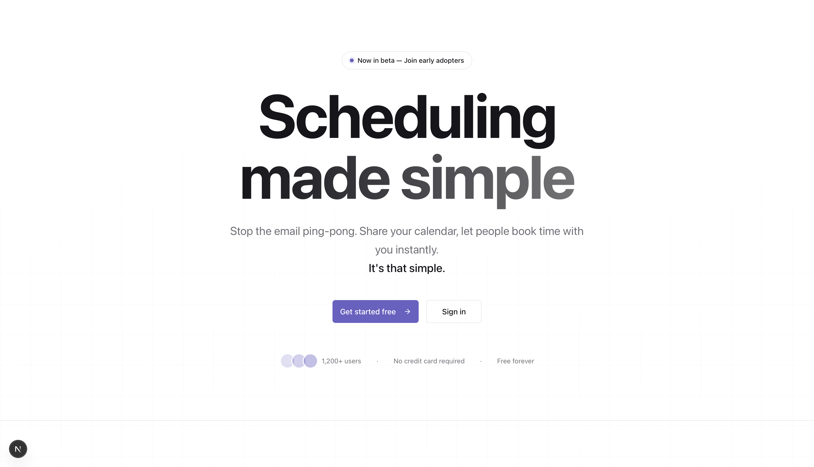
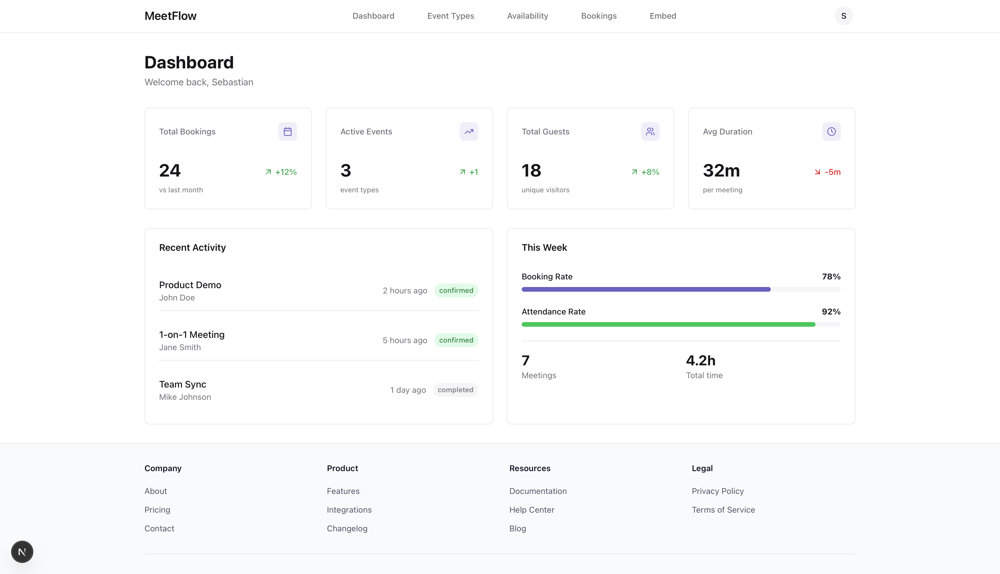
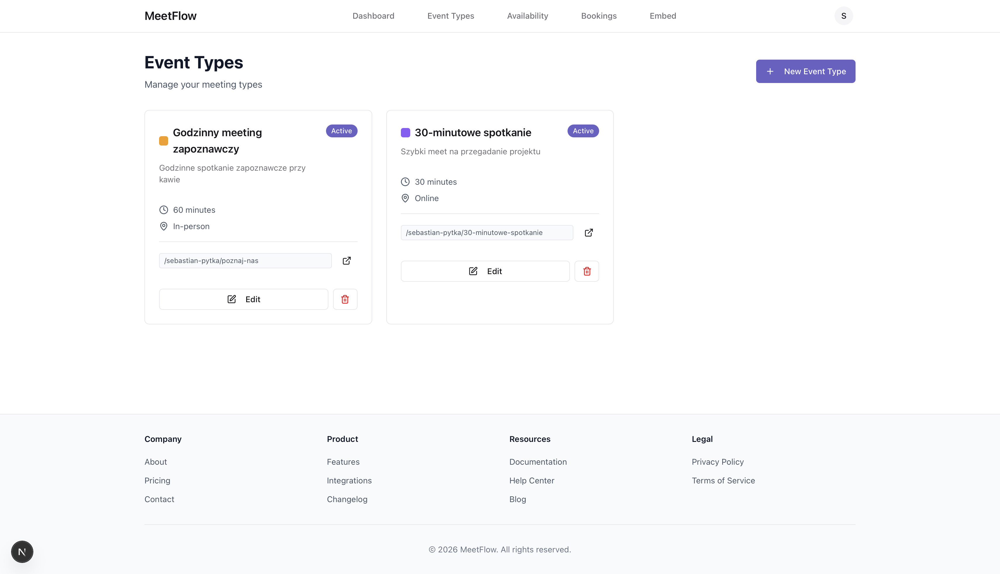
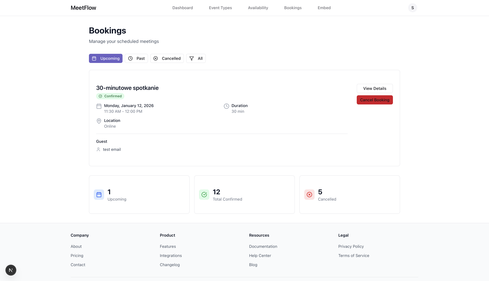
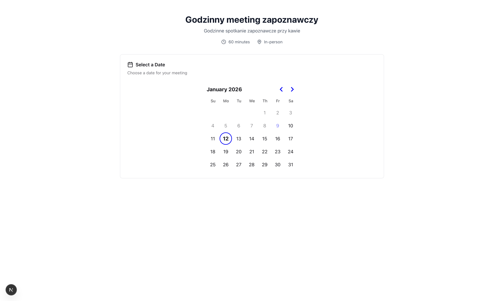

# MeetFlow

<div align="center">

  **Modern Meeting Scheduling Platform**

  [](https://nextjs.org/)
  [](https://www.typescriptlang.org/)
  [](LICENSE)
</div>

## 📖 Overview

MeetFlow is a modern, user-friendly meeting scheduling platform that simplifies the process of booking appointments. Built with Next.js 16 and TypeScript, it provides a seamless experience for both meeting hosts and guests.

## ✨ Features

- **📅 Smart Scheduling** - Create custom event types with flexible duration and availability settings
- **🔗 Public Booking Pages** - Share your personalized booking link with clients and colleagues
- **📊 Dashboard Analytics** - Track your bookings, view statistics, and manage your schedule
- **🎨 Beautiful UI** - Modern, responsive design with smooth animations powered by Framer Motion
- **🔐 Secure Authentication** - Email/password and Google OAuth integration
- **📱 Mobile Responsive** - Works seamlessly on all devices
- **🌐 SEO Optimized** - Built-in meta tags, OpenGraph support, and structured data
- **📧 Email Notifications** - Automatic confirmation and reminder emails
- **🔄 Real-time Availability** - Dynamic time slot generation based on your availability
- **🎯 Widget Embedding** - Embed booking forms on external websites

## 🖼️ Screenshots

### Landing Page


### Dashboard


### Event Types Management


### Bookings Overview


### Public Booking Page


## 🛠️ Tech Stack

### Frontend
- **Framework:** Next.js 16 (App Router)
- **Language:** TypeScript
- **Styling:** Tailwind CSS
- **UI Components:** shadcn/ui (Radix UI primitives)
- **Animations:** Framer Motion
- **Forms:** React Hook Form
- **State Management:** React Hooks
- **Date Handling:** date-fns
- **Icons:** Lucide React

### Backend Integration
- RESTful API integration
- JWT authentication
- Google OAuth 2.0

## 🚀 Getting Started

### Prerequisites

- Node.js 18+
- npm/yarn/pnpm
- Backend API running (separate repository)

### Installation

1. Clone the repository
```bash
git clone https://github.com/Fablek/MeetFlow-Frontend
cd meetflow-frontend
```

2. Install dependencies
```bash
npm install
```

3. Create `.env.local` file
```env
NEXT_PUBLIC_API_URL=http://localhost:8080/api
NEXT_PUBLIC_APP_URL=http://localhost:3000
NEXT_PUBLIC_GOOGLE_CLIENT_ID=your_google_client_id
```

4. Run the development server
```bash
npm run dev
```

5. Open [http://localhost:3000](http://localhost:3000) in your browser

## 📁 Project Structure

```
meetflow-frontend/
├── app/                          # Next.js App Router pages
│   ├── [username]/              # Public profile & booking pages
│   ├── auth/                    # Authentication callbacks
│   ├── dashboard/               # Protected dashboard pages
│   │   ├── availability/        # Availability settings
│   │   ├── bookings/           # Bookings management
│   │   ├── embed/              # Widget embedding
│   │   └── event-types/        # Event types CRUD
│   ├── login/                   # Login page
│   ├── register/                # Registration page
│   ├── settings/                # User settings
│   ├── layout.tsx               # Root layout with metadata
│   ├── page.tsx                 # Landing page
│   ├── robots.ts                # SEO robots.txt
│   └── sitemap.ts               # SEO sitemap
├── components/
│   ├── auth/                    # Authentication components
│   ├── layout/                  # Layout components (Navbar, Footer)
│   ├── ui/                      # Reusable UI components (shadcn/ui)
│   └── ErrorBoundary.tsx        # Error boundary component
├── lib/
│   ├── auth.ts                  # Authentication utilities
│   └── utils.ts                 # Helper functions
├── types/
│   ├── booking.ts               # Booking type definitions
│   └── index.ts                 # General type definitions
├── public/
│   └── widget.js                # Embeddable booking widget
└── .github/
    └── screenshots/             # Screenshots for README
```

## 🔧 Environment Variables

| Variable | Description | Example |
|----------|-------------|---------|
| `NEXT_PUBLIC_API_URL` | Backend API URL | `http://localhost:8080/api` |
| `NEXT_PUBLIC_APP_URL` | Frontend app URL | `http://localhost:3000` |
| `NEXT_PUBLIC_GOOGLE_CLIENT_ID` | Google OAuth Client ID | `your-client-id.apps.googleusercontent.com` |

## 📚 Key Features Explained

### Public Booking Flow
1. Guest visits `/{username}` to see available event types
2. Guest selects an event type and is redirected to `/{username}/{slug}`
3. Guest selects date, time slot, and fills in contact details
4. Booking is created and confirmation email is sent

### Dashboard Features
- **Event Types**: Create and manage different meeting types
- **Bookings**: View upcoming, past, and cancelled bookings
- **Availability**: Set weekly working hours and custom date overrides
- **Settings**: Update profile, connect Google Calendar
- **Embed**: Generate widget code for external websites

### Widget Embedding
```html
<!-- Add to any website -->
<script
  src="https://yourdomain.com/widget.js"
  data-url="username/event-slug"
  data-button-text="Book a meeting"
  data-button-color="#006BFF"
></script>
```

## 🎨 Design System

The project uses a consistent design system built on:
- **Colors**: OKLCH color space for better color consistency
- **Typography**: Geist Sans and Geist Mono fonts
- **Spacing**: Tailwind's default spacing scale
- **Border Radius**: 12-16px for cards and containers
- **Shadows**: Multi-layer shadows for depth
- **Animations**: Smooth transitions with Framer Motion

## 🧪 Code Quality

- **TypeScript**: Strict type checking enabled
- **Error Handling**: Comprehensive error boundaries
- **Security**: Input validation, XSS prevention, secure cookies
- **Performance**: Optimized images, lazy loading, code splitting
- **Accessibility**: Semantic HTML, ARIA labels, keyboard navigation

## 📦 Build & Deploy

### Production Build
```bash
npm run build
npm start
```

### Docker (if available)
```bash
docker build -t meetflow-frontend .
docker run -p 3000:3000 meetflow-frontend
```

### Deploy to Vercel
[](https://vercel.com/new/clone?repository-url=https://github.com/yourusername/meetflow-frontend)

## 🤝 Contributing

Contributions are welcome! Please follow these steps:

1. Fork the repository
2. Create a feature branch (`git checkout -b feature/amazing-feature`)
3. Commit your changes (`git commit -m 'Add amazing feature'`)
4. Push to the branch (`git push origin feature/amazing-feature`)
5. Open a Pull Request

## 📄 License

This project is licensed under the MIT License - see the [LICENSE](LICENSE) file for details.

## 🙏 Acknowledgments

- [Next.js](https://nextjs.org/) - The React framework
- [shadcn/ui](https://ui.shadcn.com/) - Beautiful UI components
- [Framer Motion](https://www.framer.com/motion/) - Animation library
- [Tailwind CSS](https://tailwindcss.com/) - Utility-first CSS framework
- [Lucide](https://lucide.dev/) - Icon library

## 📧 Contact

Project Link: [https://github.com/yourusername/meetflow-frontend](https://github.com/yourusername/meetflow-frontend)

Backend Link: [https://github.com/Fablek/MeetFlow-Backend](https://github.com/Fablek/MeetFlow-Backend)